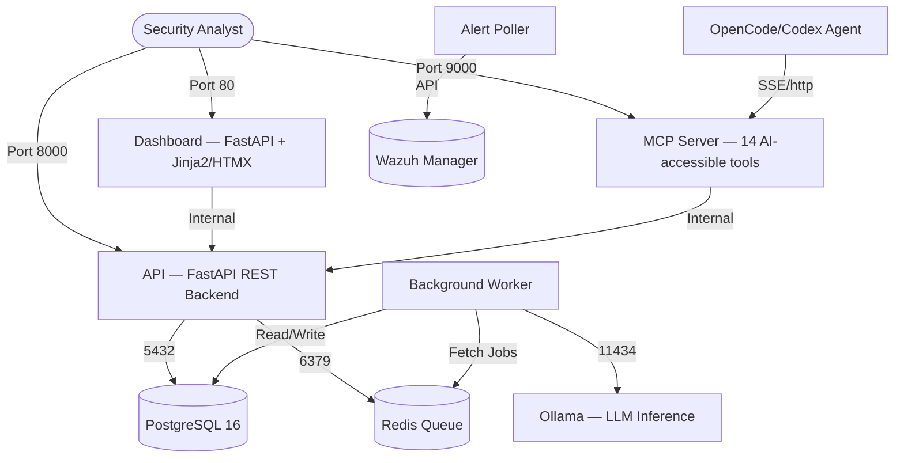

# Unified Wazuh SOC Platform — Deployment Guide

Deploy, configure, and operate the **Unified Wazuh SOC Platform** on any Linux host (EC2, bare-metal, Proxmox VM).

---

## 1. System Architecture (8 containers)



| Container | Port | Role |
|-----------|------|------|
| `soc-dashboard` | 80 | HTMX/Alpine.js dashboard for SOC analysts |
| `soc-api` | 8000 | FastAPI REST backend, Swagger at `/docs` |
| `soc-mcp` | 9000 | MCP server — 14 tools for AI agents to query Wazuh |
| `soc-worker` | — | Background workers: triage, sigma, meta_agent, prompt_refiner, RAG, OSINT, UEBA |
| `soc-postgres` | 5432 | Alert/case/agent/triage persistence |
| `soc-redis` | 6379 | Job queue + triage counters + reindex triggers |
| `soc-ollama` | 11434 | Local LLM inference (CPU-only) |
| `soc-maigret` | — | OSINT username lookup (optional) |

---

## 2. Prerequisites

- **Docker Engine** v20.10+
- **Docker Compose** v2.20+
- **Git**
- **8 vCPU / 32 GB RAM / 50+ GB disk** (EC2: `m7i.2xlarge` minimum)

---

## 3. LLM Model Tiers

The platform routes alerts through 2 tiers based on severity and risk score:

| Tier | Model | Size | Context | Role |
|------|-------|------|---------|------|
| **Fast** (noise gate) | `qwen3:4b-instruct` | 1.9 GB | 32K | Low-severity alerts, fast classification |
| **Full** (primary triage) | `Foundation-Sec-8B-Instruct` | 2.0 GB | 128K | Cybersecurity-specialized primary triage + response planning |
| **Embeddings** (RAG) | `nomic-embed-text` | 274 MB | — | Vector embeddings for skill-memory retrieval |

Optional escalation tier (domain-specialist, 4.7 GB, Wazuh-log fine-tuned):

| Escalation | `OpenNix/wazuh-llama-3.1-8B-v1` | 4.7 GB | 128K | Wazuh-log deep investigation |

Tier routing decision is in `shared/connectors/llm_router.py`. Config in `.env`:
```env
LLM_TIER_STRATEGY=auto               # fast | full | auto
LLM_TIER_FAST_MODEL=qwen3:4b-instruct
LLM_TIER_FULL_MODEL=Foundation-Sec-8B-Instruct
LLM_TIER_LEVEL_THRESHOLD=10          # alerts level >= 10 → full tier
LLM_TIER_SCORE_THRESHOLD=4           # risk score >= 4 → full tier
```

Approx. CPU latency:
- Fast tier (3B): ~10-18 tok/s → triage in ~30-60s
- Full tier (3.2B): ~10-18 tok/s → triage in ~60-90s
- Escalation (8B Q4): ~4-7 tok/s → deep investigation in ~3-4 min

---

## 4. Quick Deploy

```bash
# Clone
git clone https://github.com/shubham-landge/unified-wazuh-platform.git
cd unified-wazuh-platform

# Configure
cp .env.example .env
# Edit .env — set API_KEYS, SECRET_KEY, JWT_SECRET_KEY, Wazuh credentials, TENANT_ID

# Pull models (3-5 min, do first)
docker compose up -d ollama
docker compose exec ollama ollama pull Foundation-Sec-8B-Instruct
docker compose exec ollama ollama pull qwen3:4b-instruct
docker compose exec ollama ollama pull nomic-embed-text

# Build and start
docker compose up -d --build

# Verify
curl http://localhost:8000/health
curl http://localhost:9000/tools
docker ps --format 'table {{.Names}}\t{{.Status}}'
```

Or use the automated script:
```bash
bash deploy/ec2-setup.sh
```

---

## 5. Production Override

Apply resource limits and production flags:
```bash
docker compose -f docker-compose.yml -f docker-compose.prod.yml up -d
```

Production mode enforces:
- `WAZUH_ENV=production` → JWT_SECRET_KEY must not be default
- CPU/memory limits on all services
- Read-only root filesystems
- Stricter healthchecks

---

## 6. Verifying

| Check | Command |
|-------|---------|
| All containers healthy | `docker ps --format 'table {{.Names}}\t{{.Status}}'` |
| API health | `curl http://localhost:8000/health` |
| MCP tools | `curl http://localhost:9000/tools` |
| Dashboard | Browser → `http://YOUR-IP` |
| API docs | Browser → `http://YOUR-IP:8000/docs` |
| Models loaded | `docker compose exec ollama ollama list` |
| Diagnostic script | `bash deploy/status.sh` |
| Daily health check | `bash scripts/daily-health-check.sh` |

---

## 7. Troubleshooting

```bash
# API logs
docker compose logs -f api

# Worker logs (triage, meta_agent, prompt_refiner)
docker compose logs -f worker

# MCP server logs
docker compose logs -f mcp

# Ollama logs
docker compose logs -f ollama

# Check triage flow
docker compose logs worker 2>&1 | grep -i "triage\|suppressed\|tier"

# Restart specific service
docker compose restart api worker

# Full restart
docker compose down && docker compose up -d --build
```

---

## 8. Config Reference

Key `.env` sections you must set:

| Variable | Purpose |
|----------|---------|
| `SECRET_KEY` | FastAPI secret (random 64-char) |
| `JWT_SECRET_KEY` | JWT signing key (random 32+ chars) |
| `API_KEYS` | Comma-separated API keys for auth |
| `API_KEY_DEFAULT_TENANT` | Default tenant UUID for server-side ingestion |
| `WAZUH_API_URL` | Wazuh Manager API URL |
| `WAZUH_API_USER` / `WAZUH_API_PASSWORD` | Read-only Wazuh API credentials |
| `WAZUH_INDEXER_URL` | Wazuh Indexer (OpenSearch) URL |
| `WAZUH_INDEXER_USER` / `WAZUH_INDEXER_PASSWORD` | Indexer credentials |
| `DASHBOARD_ADMIN_EMAIL` / `DASHBOARD_ADMIN_PASSWORD` | Dashboard admin login |
| `TENANT_ID` | Multi-tenant UUID for your organization |

---

## 9. Self-Learning Components

The worker runs two autonomous background loops:

| Component | Interval | Function |
|-----------|----------|----------|
| `meta_agent.py` | 24h | Scans for alerts with no triage (DB + Wazuh Indexer), feeds missed detections into RAG, pushes level ≥ 10 alerts back into re-triage queue |
| `prompt_refiner.py` | 60s | Reads low-rated feedback (rating ≤ 2), clusters by error type, generates improved prompts via LLM, archives old prompts, shadow-evaluates before promoting |

Both store results in `AgentTask` → `skill_memory` → RAG vector store.
