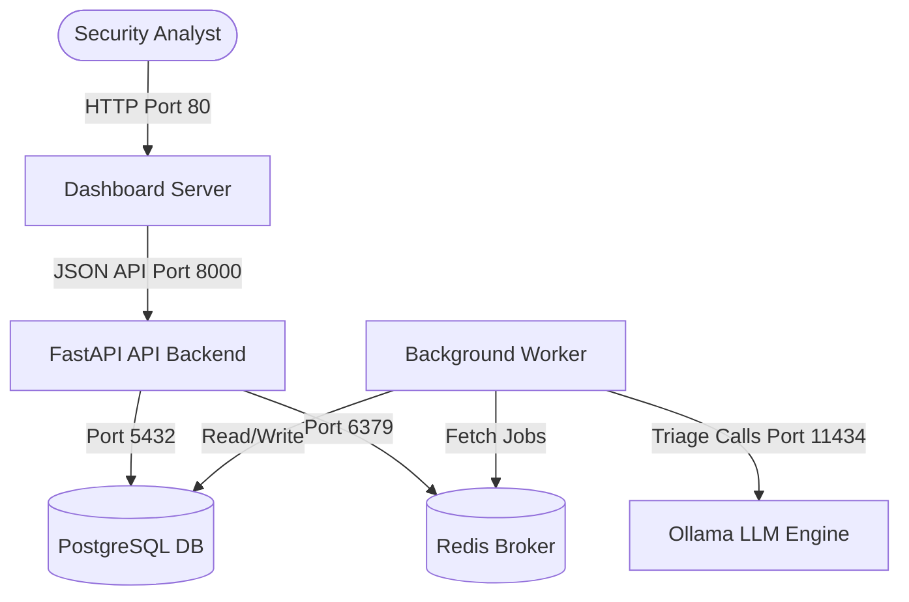

# Unified Wazuh SOC Platform Deployment Guide

This document describes how to deploy, configure, and operate the **Unified Wazuh SOC Platform** in local and production environments.

---

## 1. System Architecture

The platform operates as a multi-tier containerized stack:



* **Dashboard Server**: FastAPI web app serving server-side templates (Jinja2/HTMX/Alpine.js).
* **API Backend**: FastAPI REST backend connecting to the database and queue.
* **PostgreSQL Database**: Holds cases, notes, normalized alerts, and asset inventories.
* **Redis Queue**: Broker for background vulnerability enrichment and scheduled polling tasks.
* **Background Worker**: Python process executing EPSS/KEV API lookups and LLM evaluations.
* **Ollama (Optional)**: Container running locally to host LLMs (e.g. Llama 3) for zero-cloud triage data privacy.

---

## 2. Prerequisites

Ensure you have the following installed on the target machine:
* **Docker Engine** (v20.10+)
* **Docker Compose** (v2.20+)
* **Git** (to clone repository)

---

## 3. Configuration & Environment Variables

All settings are configured via the `.env` file in the repository root.

1. Copy the example configuration:
   ```bash
   cp .env.example .env
   ```

2. Edit `.env` to customize parameters:
   ```env
   # Database Credentials
   DATABASE_PASSWORD=soc_secure_pass_123

   # Redis Configuration
   REDIS_PASSWORD=redis_secure_pass_123

   # Security API Keys (Comma-separated keys for Dashboard and Collectors)
   API_KEYS=soc-key-001,soc-key-002,soc-key-003

   # AI Triage Setup
   OLLAMA_MODEL=llama3
   OLLAMA_BASE_URL=http://ollama:11434

   # Cloud Providers (Optional fallback models)
   OPENAI_API_KEY=your_openai_key
   GEMINI_API_KEY=your_gemini_key
   CLAUDE_API_KEY=your_anthropic_key
   ```

---

## 4. Deploying the Stack

Start all services in detached mode:

```bash
docker compose up -d
```

### Initial database state
When the Postgres container starts for the first time, it automatically reads the SQL schema located in `database/schema.sql` to initialize all relational tables, indices, and triggers.

### Scaling Background Processing
If you ingest a large volume of alerts daily, you can scale the background enrichment workers:

```bash
docker compose up -d --scale worker=3
```

---

## 5. Verifying Integration & Health

1. **Dashboard Access**: Open your browser and navigate to `http://localhost/`.
2. **REST API Documentation**: AccessSwagger docs at `http://localhost:8000/docs/`.
3. **Internal Status Script**: Run the diagnostic CLI tool:
   ```bash
   bash deploy/status.sh
   ```

---

## 6. Troubleshooting Logs

If a component is degraded, inspect its logs:

* **Dashboard logs**: `docker compose logs -f dashboard`
* **API logs**: `docker compose logs -f api`
* **Worker logs**: `docker compose logs -f worker`
* **Postgres diagnostics**: `docker compose logs -f postgres`
