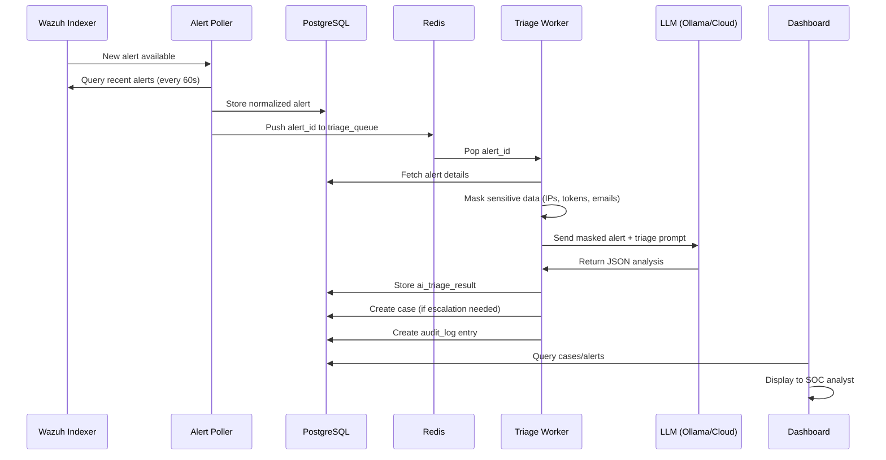

# Alert Triage Flow

```mermaid
sequenceDiagram
    participant W as Wazuh Indexer
    participant P as Alert Poller
    participant DB as PostgreSQL
    participant R as Redis
    participant T as Triage Worker
    participant L as LLM (Ollama/Cloud)
    participant D as Dashboard

    W->>P: New alert available
    P->>W: Query recent alerts (every 60s)
    P->>DB: Store normalized alert
    P->>R: Push alert_id to triage_queue
    R->>T: Pop alert_id
    T->>DB: Fetch alert details
    T->>T: Mask sensitive data (IPs, tokens, emails)
    T->>L: Send masked alert + triage prompt
    L->>T: Return JSON analysis
    T->>DB: Store ai_triage_result
    T->>DB: Create case (if escalation needed)
    T->>DB: Create audit_log entry
    D->>DB: Query cases/alerts
    D->>D: Display to SOC analyst
```
