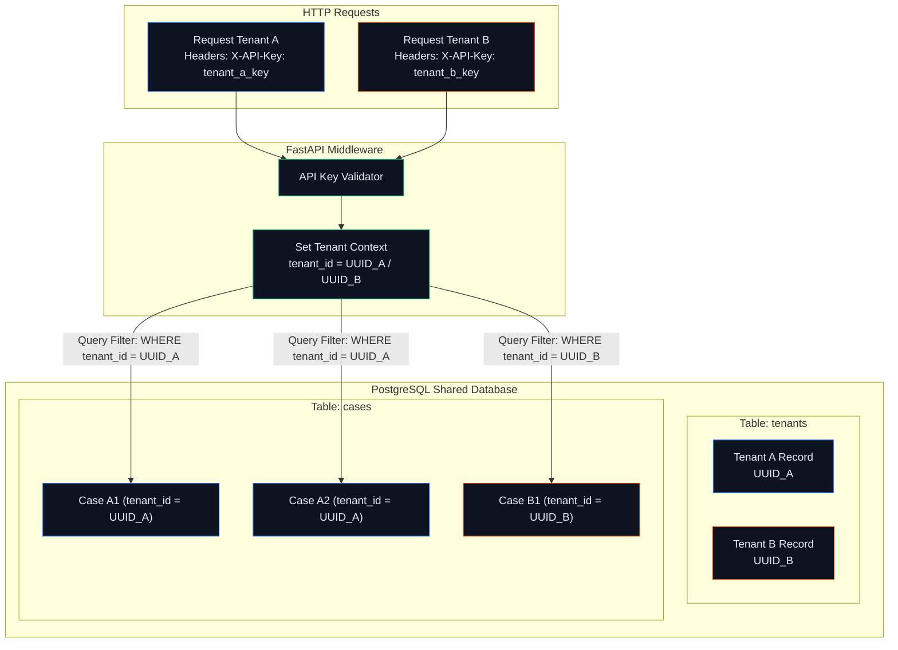

# Multi-Tenant Data Isolation

This diagram illustrates how data isolation is enforced between different tenants inside the shared PostgreSQL database.

```mermaid
graph TD
    subgraph "HTTP Requests"
        REQ1["Request Tenant A<br/>Headers: X-API-Key: tenant_a_key"]
        REQ2["Request Tenant B<br/>Headers: X-API-Key: tenant_b_key"]
    end

    subgraph "FastAPI Middleware"
        AUTH["API Key Validator"]
        CONTEXT["Set Tenant Context<br/>tenant_id = UUID_A / UUID_B"]
    end

    subgraph "PostgreSQL Shared Database"
        subgraph "Table: tenants"
            T_A["Tenant A Record<br/>UUID_A"]
            T_B["Tenant B Record<br/>UUID_B"]
        end
        subgraph "Table: cases"
            C_A1["Case A1 (tenant_id = UUID_A)"]
            C_A2["Case A2 (tenant_id = UUID_A)"]
            C_B1["Case B1 (tenant_id = UUID_B)"]
        end
    end

    REQ1 --> AUTH
    REQ2 --> AUTH
    AUTH --> CONTEXT
    CONTEXT -->|Query Filter: WHERE tenant_id = UUID_A| C_A1
    CONTEXT -->|Query Filter: WHERE tenant_id = UUID_A| C_A2
    CONTEXT -->|Query Filter: WHERE tenant_id = UUID_B| C_B1

    classDef tenantA fill:#0d1321,stroke:#3b82f6,color:#e8edf5
    classDef tenantB fill:#0d1321,stroke:#ea580c,color:#e8edf5
    classDef middleware fill:#0d1321,stroke:#10b981,color:#e8edf5
    class REQ1,T_A,C_A1,C_A2 tenantA
    class REQ2,T_B,C_B1 tenantB
    class AUTH,CONTEXT middleware
```
