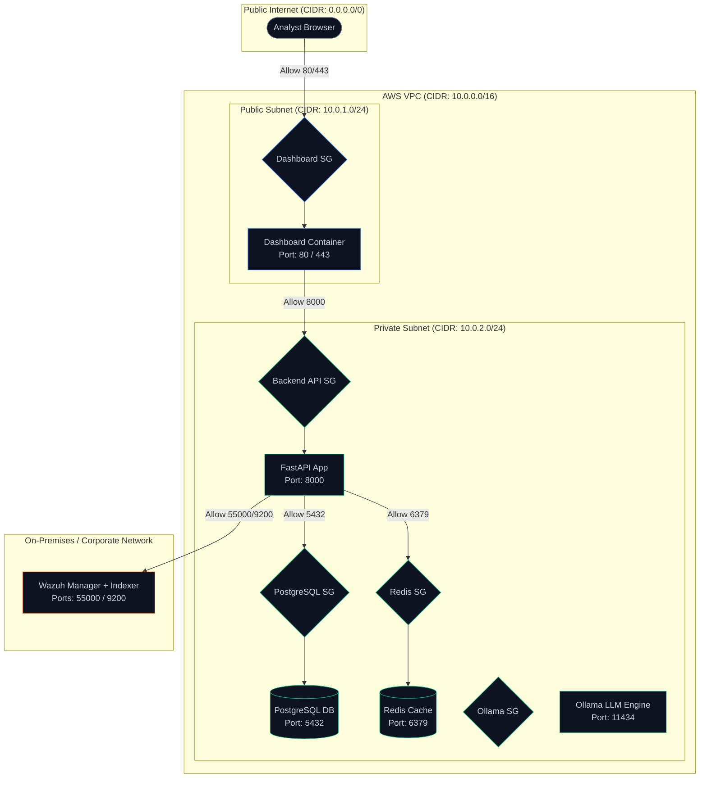

# Network Security Layout

This diagram maps the network segments, firewalls, ports, and allowed CIDRs that secure the platform deployment.

```mermaid
graph TD
    subgraph "Public Internet (CIDR: 0.0.0.0/0)"
        ANALYST([Analyst Browser])
    end

    subgraph "AWS VPC (CIDR: 10.0.0.0/16)"
        subgraph "Public Subnet (CIDR: 10.0.1.0/24)"
            direction TB
            DASH_SG{"Dashboard SG"}
            DASH["Dashboard Container<br/>Port: 80 / 443"]
        end

        subgraph "Private Subnet (CIDR: 10.0.2.0/24)"
            direction TB
            API_SG{"Backend API SG"}
            API["FastAPI App<br/>Port: 8000"]
            
            DB_SG{"PostgreSQL SG"}
            DB[("PostgreSQL DB<br/>Port: 5432")]
            
            REDIS_SG{"Redis SG"}
            REDIS[("Redis Cache<br/>Port: 6379")]
            
            OLLAMA_SG{"Ollama SG"}
            OLLAMA["Ollama LLM Engine<br/>Port: 11434"]
        end
    end

    subgraph "On-Premises / Corporate Network"
        WAZUH["Wazuh Manager + Indexer<br/>Ports: 55000 / 9200"]
    end

    ANALYST -->|Allow 80/443| DASH_SG
    DASH_SG --> DASH
    
    DASH -->|Allow 8000| API_SG
    API_SG --> API
    
    API -->|Allow 5432| DB_SG
    DB_SG --> DB
    
    API -->|Allow 6379| REDIS_SG
    REDIS_SG --> REDIS
    
    API -->|Allow 55000/9200| WAZUH
    
    classDef public fill:#0d1321,stroke:#64748b,color:#cbd5e1
    classDef dashboard fill:#0d1321,stroke:#3b82f6,color:#cbd5e1
    classDef backend fill:#0d1321,stroke:#10b981,color:#cbd5e1
    classDef wazuh fill:#0d1321,stroke:#ea580c,color:#cbd5e1
    
    class ANALYST public
    class DASH_SG,DASH dashboard
    class API_SG,API,DB_SG,DB,REDIS_SG,REDIS,OLLAMA_SG,OLLAMA backend
    class WAZUH wazuh
```
