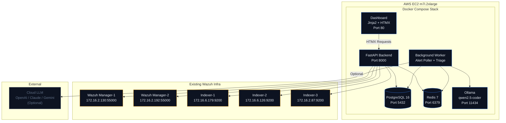

# System Architecture

```mermaid
graph TB
    subgraph "AWS EC2 m7i.2xlarge"
        subgraph "Docker Compose Stack"
            API["FastAPI Backend<br/>Port 8000"]
            WORKER["Background Worker<br/>Alert Poller + Triage"]
            DASH["Dashboard<br/>Jinja2 + HTMX<br/>Port 80"]
            DB[("PostgreSQL 16<br/>Port 5432")]
            REDIS[("Redis 7<br/>Port 6379")]
            OLLAMA["Ollama<br/>qwen2.5-coder<br/>Port 11434"]
        end
    end

    subgraph "Existing Wazuh Infra"
        WAM1["Wazuh Manager-1<br/>172.16.2.130:55000"]
        WAM2["Wazuh Manager-2<br/>172.16.2.192:55000"]
        WIX1["Indexer-1<br/>172.16.6.179:9200"]
        WIX2["Indexer-2<br/>172.16.6.126:9200"]
        WIX3["Indexer-3<br/>172.16.2.87:9200"]
    end

    subgraph "External"
        LLM_CLOUD["Cloud LLM<br/>OpenAI / Claude / Gemini<br/>(Optional)"]
    end

    API --> DB
    API --> REDIS
    WORKER --> DB
    WORKER --> REDIS
    WORKER --> OLLAMA
    WORKER -->|Optional| LLM_CLOUD
    API --> WAM1
    API --> WAM2
    API --> WIX1
    API --> WIX2
    API --> WIX3
    DASH -->|HTMX Requests| API

    classDef aws fill:#0d1321,stroke:#3b82f6,color:#e8edf5
    classDef wazuh fill:#0d1321,stroke:#f59e0b,color:#e8edf5
    classDef external fill:#0d1321,stroke:#64748b,color:#64748b
    class API,WORKER,DASH,DB,REDIS,OLLAMA aws
    class WAM1,WAM2,WIX1,WIX2,WIX3 wazuh
    class LLM_CLOUD external
```
