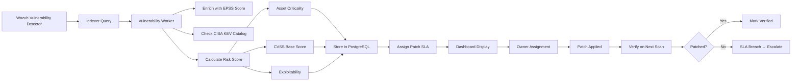

# Vulnerability Workflow

```mermaid
graph LR
    A[Wazuh Vulnerability Detector] --> B[Indexer Query]
    B --> C[Vulnerability Worker]
    C --> D[Enrich with EPSS Score]
    C --> E[Check CISA KEV Catalog]
    C --> F[Calculate Risk Score]
    F --> G[Asset Criticality]
    F --> H[CVSS Base Score]
    F --> I[Exploitability]
    G --> J[Store in PostgreSQL]
    H --> J
    I --> J
    J --> K[Assign Patch SLA]
    K --> L[Dashboard Display]
    L --> M[Owner Assignment]
    M --> N[Patch Applied]
    N --> O[Verify on Next Scan]
    O --> P{Patched?}
    P -->|Yes| Q[Mark Verified]
    P -->|No| R[SLA Breach → Escalate]
```
